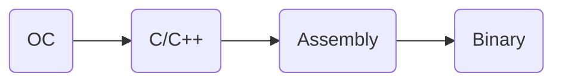






**Objective-C代码转换为C、C++代码**

```s
// 终端命令
xcrun -sdk iphoneos clang -arch arm64 -rewrite-objc main.c -o main.cpp
xcrun -sdk iphoneos clang -arch arm64 -rewrite-objc “oc源文件” -o “输出cpp文件”
```

## 一个OC对象在内存中是如何布局的？

```objc
// alloc 申请一块内存空间，init 初始化一个类的实例对象
NSObject *obj = [[NSObject alloc] init];
```



OC基本数据类型所占字节数对比

|C|OC|32Bit|64Bit|
|---|---|---|---|
|bool|BOOL(64)|1|1|
|char|int8_t \ BOOL(32)|1|1|
|Unsigned char|Boolean|1|1|
|short|int16_t|2|2|
|Unsigned short|unichar|2|2|
|int|int32_t \ NSInteger(32) \ boolean_t(32)|4|4|
|Unsigned int|boolean_t(64) \ NSUInteger(32)|4|4|
|long|NSInteger(64)|4|8|
|Unsigned long|NSUInteger(64)|4|8|
|long long|int64_t|8|8|
|float|CGFloat(32)|4|4|
|double|CGFloat(64)|8|8|

## 参考
1. [OC基本数据类型](https://www.daimajiaoliu.com/daima/4ed3aba5710041c)

2. [关于NSObject对象的内存布局，看我就够了！](https://zhuanlan.zhihu.com/p/98432137)

## 实时查看内存数据



### 创建一个实例对象，至少需要多少内存？

一个对象至少需要8个字节

```objc
#import <objc/runtime.h>
class_getInstanceSize([NSObject class]);
```

### 创建一个实例对象，实际分配了多少内存？
64位系统至少会分配16个字节，32位则是8个字节。
```objc
#import <malloc/malloc.h>
NSObject *obj = [[NSObject alloc] init];
malloc_size((__bridge const void *)obj);
```

### 常用LLDB指令



**读取内存**
- Memory read/数量格式字节数 内存地址
- x/数量格式字节数 内存地址



**格式**

x是16进制，f是浮点数，d是10进制

**字节大小**

- b：byte 1字节
- h：half wrod 2字节
- w： word 4字节
- g：giant word 8字节

**修改内存中的值**

- memory write 内存地址 数值：memory write 0x0000010 10